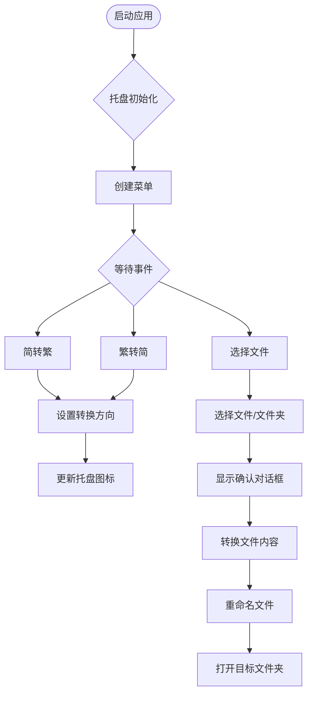

# File Fusion Rename

<div align="center">

[](https://github.com/DavidKk/go-file-fusion-rename/actions)
[](https://github.com/DavidKk/go-file-fusion-rename/releases)
[](https://opensource.org/licenses/MIT)
[](https://996.icu)

一个功能强大的中文文件名与文件内容简繁体转换工具

[下载](https://github.com/DavidKk/go-file-fusion-rename/releases) • [功能特性](#功能特性) • [快速开始](#快速开始)

</div>

## 功能特性

### 🔄 双向转换
- **简体转繁体**：支持简体中文到繁体中文的转换
- **繁体转简体**：支持繁体中文到简体中文的转换
- **智能检测**：自动识别文本语言类型，避免重复转换

### 📂 批量处理
- **文件批量重命名**：支持单个文件或整个文件夹的批量重命名
- **内容同步转换**：不仅转换文件名，还能转换文件内容中的中文文本
- **安全机制**：先处理文件，再处理文件夹，避免路径冲突

### 🖥️ 友好界面
- **系统托盘集成**：常驻系统托盘，随时可用
- **右键菜单**：简洁的右键菜单操作
- **确认对话框**：执行前显示预览，确保操作安全

### ⚡ 高性能
- **Go语言开发**：原生性能，启动快速
- **跨平台支持**：支持 Windows、macOS、Linux
- **轻量级**：占用系统资源少

## 快速开始

### 安装

从 [Releases](https://github.com/DavidKk/go-file-fusion-rename/releases) 页面下载对应平台的版本：

- **Windows**: `file-fusion-rename-windows.zip`
- **macOS**: `File-Fusion-Rename-macOS-App.zip` (通用二进制文件，支持 Intel 和 Apple Silicon)
- **Linux**: `file-fusion-rename-linux.zip`

### 使用方法

1. **启动应用**
   - 解压下载的文件
   - 运行可执行文件，应用会出现在系统托盘

2. **设置转换方向**
   - 右键点击托盘图标
   - 选择 "简转繁" 或 "繁转简"

3. **执行转换**
   - 点击 "选择文件" 选择要转换的文件或文件夹
   - 在确认对话框中预览转换结果
   - 点击确认执行转换

## 工作流程



## 技术架构

- **前端框架**: [Fyne](https://fyne.io/) - Go语言跨平台GUI框架
- **系统托盘**: [systray](https://github.com/getlantern/systray) - 跨平台系统托盘库
- **中文转换**: [OpenCC](https://github.com/longbridgeapp/opencc) - 中文简繁体转换库
- **文件对话框**: [zenity](https://github.com/ncruces/zenity) - 原生文件对话框

## 开发与构建

### 环境要求

- Go 1.24+
- GUI 开发依赖（Linux需要安装GTK开发库）

### 本地开发

```bash
# 克隆仓库
git clone https://github.com/DavidKk/go-file-fusion-rename.git
cd go-file-fusion-rename

# 安装依赖
go mod download

# 运行应用
go run main.go

# 构建
make build
```

### 跨平台构建

项目使用 GitHub Actions 自动构建多平台版本：
- 自动测试
- 多平台构建（Linux、Windows、macOS Intel、macOS ARM64）
- 自动发布到 GitHub Releases

## 许可证

本项目采用 MIT 许可证 - 查看 [LICENSE](LICENSE) 文件了解详情

## 贡献

欢迎提交 Issue 和 Pull Request！

---

<div align="center">

**[⬆ 回到顶部](#file-fusion-rename)**

</div>